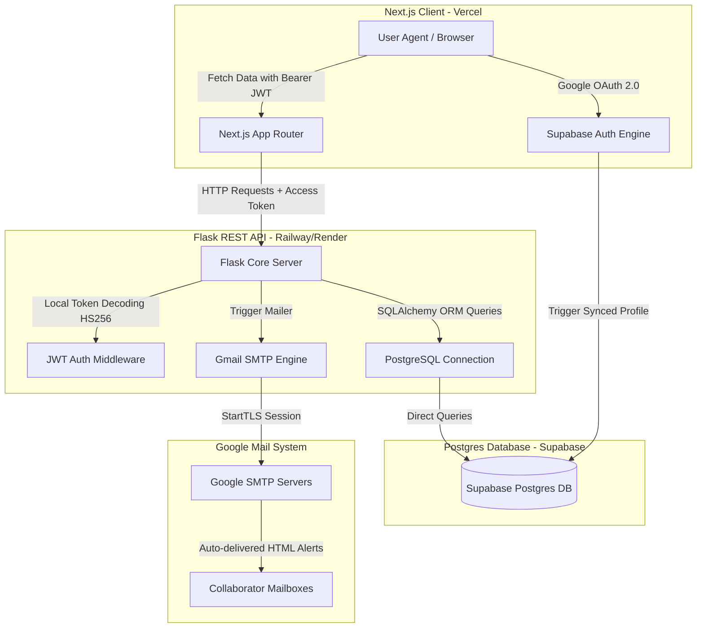

# Assignly 🚀

Assignly is a modern, high-fidelity, and secure task management web application that enables collaborative teams to organize, prioritize, and delegate tasks seamlessly. Featuring deep Google OAuth 2.0 authentication and automated transactional Gmail notifications, the platform ensures teams remain in sync in real-time.

---

## Technical Stack & Architecture

Assignly is built using a highly optimized, cross-origin decouple model that guarantees speed, type-safety, and seamless cross-platform synchronization.



### Key Components

1. **Frontend (Next.js + TypeScript + Tailwind CSS)**
   * Built with standard App Router.
   * Responsive Kanban Board split by stages: *To Do*, *In Progress*, and *Completed*.
   * Seamless user registration and authentication via Google OAuth 2.0 handled securely in client cookies.
   * State-of-the-art dark-theme UI featuring glowing accent structures and glassmorphism.
2. **Backend (Flask + SQLAlchemy)**
   * Clean RESTful API serving JSON payloads with full CORS enabled.
   * Custom token validation decorator (`@require_auth`) decoding Supabase user access tokens locally.
   * PostgreSQL connectivity using raw optimized transactions under Flask-SQLAlchemy.
3. **Database (Supabase PostgreSQL + Trigger sync)**
   * Multi-table model storing user profiles and tasks with cascade deletions.
   * **PostgreSQL Database Trigger** listening to signs up in `auth.users` to automatically populate the public profile with Google display names, emails, and profile picture avatars.
4. **Email (Gmail SMTP Integration)**
   * Sends responsive, visually striking HTML transactional notification emails when tasks are assigned or marked as completed.

---

## Repository Directory Layout

```text
/
├── migrations/                  # Database migration schemas
│   └── 01_init_schema.sql       # Live schema SQL with tables, triggers & RLS
├── backend/                     # Python Flask REST API
│   ├── app.py                   # Main Flask API controllers and middleware
│   ├── config.py                # Environment variable configuration loading
│   ├── models.py                # Flask-SQLAlchemy database mappings
│   ├── email_utils.py           # Gmail SMTP email senders and HTML templates
│   ├── requirements.txt         # Pip package dependency checklist
│   ├── apply_migrations.py      # Direct Python script applying SQL to Supabase
│   └── .env.example             # Backend local environment placeholders
├── frontend/                    # Next.js Single Page Application
│   ├── src/
│   │   ├── app/                 # Next.js App Router Page components
│   │   │   ├── layout.tsx       # Global layouts & custom app metadata
│   │   │   ├── page.tsx         # Landing/Login page with Google Auth trigger
│   │   │   ├── dashboard/       # Kanban board task manager dashboard
│   │   │   └── auth/callback/   # Google OAuth callback router
│   │   └── lib/
│   │       └── supabase.ts      # Supabase Browser client initialization
│   ├── package.json             # Node package dependency checklist
│   └── .env.example             # Frontend local environment placeholders
├── .gitignore                   # Global file ignore listings (protects local secrets)
├── .env.example                 # Combined repository environment placeholders
└── README.md                    # Core architecture blueprint and execution guide
```

---

## Environment Variables Configuration Guide

To launch the project, create `.env` in the `/backend` folder and `.env.local` in the `/frontend` folder:

### Backend Variables (`backend/.env`)
* `DATABASE_URL`: The direct connection URI to the Supabase Postgres instance.
* `SUPABASE_JWT_SECRET`: Secret key used to decode client tokens (Supabase Dashboard -> Settings -> API).
* `SMTP_USER`: System Gmail address used to transmit notifications.
* `SMTP_PASSWORD`: **16-character Google App Password** generated under Google Account Security (requires 2-Step Verification).
* `SMTP_SERVER`: `smtp.gmail.com`
* `SMTP_PORT`: `587`
* `FRONTEND_URL`: URL pointing to the Next.js client (e.g. `http://localhost:3000`).

### Frontend Variables (`frontend/.env.local`)
* `NEXT_PUBLIC_SUPABASE_URL`: The API URL of your Supabase project.
* `NEXT_PUBLIC_SUPABASE_ANON_KEY`: The anonymous API client key of your Supabase project.
* `NEXT_PUBLIC_BACKEND_URL`: The API endpoint of your Flask backend (e.g. `http://localhost:5000`).

---

## Database Schema & Trigger Specs

```sql
-- Profiles table representing verified users
CREATE TABLE public.profiles (
    id UUID REFERENCES auth.users ON DELETE CASCADE PRIMARY KEY,
    email VARCHAR(255) UNIQUE NOT NULL,
    full_name VARCHAR(255),
    avatar_url TEXT,
    created_at TIMESTAMP WITH TIME ZONE DEFAULT TIMEZONE('utc'::text, NOW()) NOT NULL,
    updated_at TIMESTAMP WITH TIME ZONE DEFAULT TIMEZONE('utc'::text, NOW()) NOT NULL
);

-- Tasks table representing deliverables
CREATE TABLE public.tasks (
    id UUID DEFAULT gen_random_uuid() PRIMARY KEY,
    title VARCHAR(255) NOT NULL,
    description TEXT,
    status VARCHAR(50) DEFAULT 'todo' NOT NULL,
    priority VARCHAR(50) DEFAULT 'medium' NOT NULL,
    due_date TIMESTAMP WITH TIME ZONE,
    created_by UUID REFERENCES public.profiles(id) ON DELETE CASCADE NOT NULL,
    assigned_to UUID REFERENCES public.profiles(id) ON DELETE SET NULL,
    created_at TIMESTAMP WITH TIME ZONE DEFAULT TIMEZONE('utc'::text, NOW()) NOT NULL,
    updated_at TIMESTAMP WITH TIME ZONE DEFAULT TIMEZONE('utc'::text, NOW()) NOT NULL
);

-- Automatic synchronization trigger function
CREATE OR REPLACE FUNCTION public.handle_new_user()
RETURNS TRIGGER AS $$
BEGIN
    INSERT INTO public.profiles (id, email, full_name, avatar_url)
    VALUES (
        NEW.id,
        NEW.email,
        COALESCE(NEW.raw_user_meta_data->>'full_name', NEW.raw_user_meta_data->>'name', 'User'),
        COALESCE(NEW.raw_user_meta_data->>'avatar_url', NEW.raw_user_meta_data->>'picture', '')
    )
    ON CONFLICT (id) DO UPDATE SET
        email = EXCLUDED.email,
        full_name = EXCLUDED.full_name,
        avatar_url = EXCLUDED.avatar_url,
        updated_at = NOW();
    RETURN NEW;
END;
$$ LANGUAGE plpgsql SECURITY DEFINER;
```

---

## Detailed Local Setup & Launch Guide

### 1. Database Setup
Ensure your Supabase project is active, then execute the schemas and triggers by running the Python applicator inside the `/backend` directory:
```bash
cd backend
python -m venv venv
# On Windows PowerShell:
.\venv\Scripts\Activate.ps1
# On Linux/macOS:
source venv/bin/activate

pip install -r requirements.txt
python apply_migrations.py
```

### 2. Launch Flask Backend
Execute the Flask server:
```bash
python app.py
```
The server will boot on `http://localhost:5000` with active CORS mapping.

### 3. Launch Next.js Frontend
Open a new terminal session, navigate to the frontend directory, install npm modules, and run the developer server:
```bash
cd frontend
npm install
npm run dev
```
Open `http://localhost:3000` inside your browser to start allocating tasks!

---

## Production Deployment Blueprint

### A. Deploy Database (Supabase)
The database tables, user triggers, Row Level Security (RLS) policies, and public access endpoints are already fully active once step 1 of local setup is executed!

### B. Deploy Flask Backend (Railway / Render)
1. Push this git repository to your GitHub account.
2. Sign in to **Render** (render.com) or **Railway** (railway.app) and link the git repository.
3. Select **Python Web Service**, set root folder as `backend`, and set launch start command as:
   ```bash
   gunicorn app:app
   ```
4. Map all environment variables directly into the service settings page (`DATABASE_URL`, `SUPABASE_JWT_SECRET`, `SMTP_USER`, `SMTP_PASSWORD`, and `FRONTEND_URL`).

### C. Deploy Frontend (Vercel)
1. Go to **Vercel** (vercel.com), select **Add New Project**, and link your repository.
2. Set the root folder option as `frontend`.
3. In **Environment Variables**, map:
   * `NEXT_PUBLIC_SUPABASE_URL`
   * `NEXT_PUBLIC_SUPABASE_ANON_KEY`
   * `NEXT_PUBLIC_BACKEND_URL`: Set this pointing to your live Flask backend domain on Railway/Render.
4. Click **Deploy**. Vercel will compile and host the app globally on the first try!

### D. Configure OAuth Redirects on Supabase
1. In your **Supabase Dashboard**, go to **Auth** -> **Providers** -> **Google**.
2. Input your Google Client ID and Client Secret (obtained from Google Cloud Console).
3. Copy the **Redirect URI** provided by Supabase and paste it into your Google Cloud OAuth Client credentials screen.
4. In **Supabase Dashboard**, go to **Auth** -> **URL Configuration**. Set the **Site URL** as your live Vercel URL, and add `https://your-vercel-domain.vercel.app/auth/callback` to **Redirect URLs**.

You are now 100% production live with fully synchronized task boards and Gmail notification delivery!
